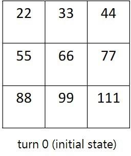
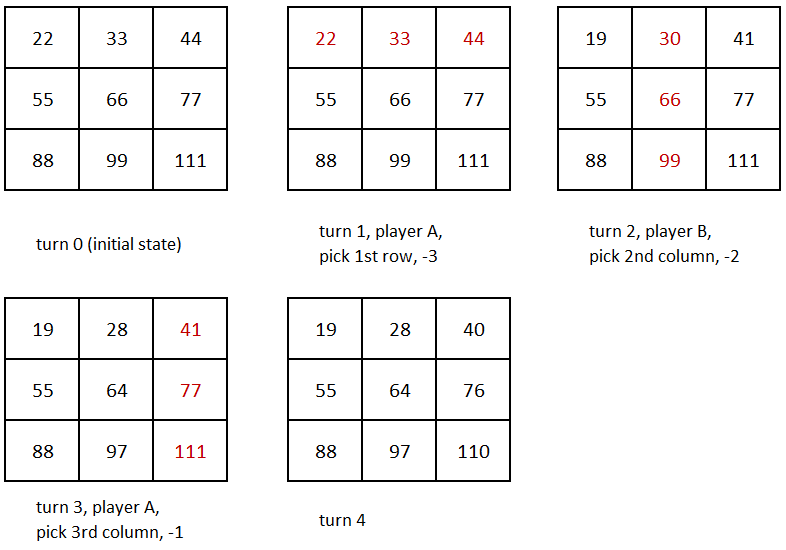
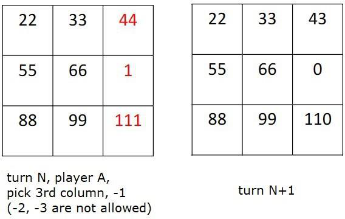
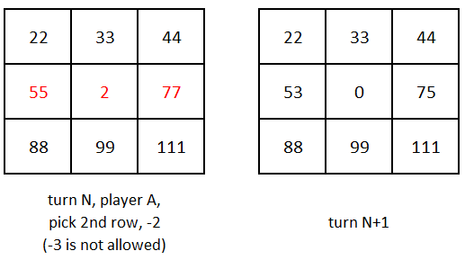
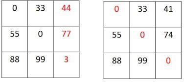
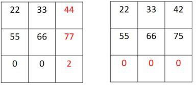
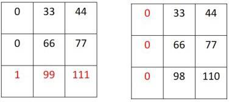
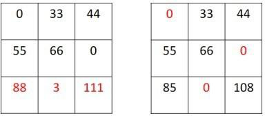

# NYCU-AI-2023
# AI Term Project Spring 2023

Due Date: 11:50 PM June 16, 2023

**1.   Project objective:**

     Design an AI program to play a two-player 3x3 board game.

**2.   Language:**

     C++, Python

**3.   Game Rules:**

     a. At the beginning of the game, the 3x3 board is randomly filled with positive integers*, and the order of play is determined for the two players.

     b. On each turn, a player must choose a row or column that does not contain the number 0, and select a number, 1, 2 or 3 to subtract from each of the integers in that row or column.

        This number represents the cost of the player's move. If the resulting board does not meet any of the termination conditions*, play continues with the other player.

     c. There are restrictions on the numbers that can be subtracted. 

        If a row or column contains the number 1, the player can only subtract 1 from each number in that row or column.

     If a row or column contains the number 2 but not the number 1, the player can only subtract either 1 or 2 from each number in that row or column.

     d. The game ends when one of two termination conditions is met:

        Termination condition 1: If all the numbers in any row, column, or diagonal become 0, the game ends and the player who achieves this condition is rewarded* with a bonus.

or

or

     Termination condition 2: If every row or column contains the number 0 and termination condition 1 has not occurred, the game ends and the player who achieves this condition is penalized with an extra cost*.

     e.  The player with the lowest total cost at the end of the game is declared the winner.

     f.  There is a time limit of 60 seconds for each move, and any player who exceeds the time limit will lose the game.

Note: * Further details about the game setting will be announced on e3 later.

**4.**   **What to turn in:**

     ◼  A report of the search strategy of your own design (student_ID.pdf, e.g. 309554041.pdf). 

     ◼  A copy of your source code (student_ID.py, e.g. 309554041.py).

     ◼  Please zip all your files (student_ID.zip, e.g. 309554041.zip).

     ◼  Any violation of the file name format will incur 5 pts penalty deduction.
**5.**   **Grading policy:**

◼  Coding (60%)

⮳  Tournament

     ⚫  You will be randomly grouped, and a double elimination tournament will be held. 

     ⚫  The higher the ranking, the more points you will receive.

     ⚫  You will receive a reasonable number of points for your project if you turn in what you are supposed to, even if your AI program is not among the top-ranking programs in the class. 

     ⚫  To be fair, an incomplete project will incur a low grade.
     
◼  Report (40%)

⮳  Design philosophy (20%)

     ⚫  If your algorithm completely relies on randomness, you will get zero point. 

     ⚫  Clearly describe your algorithm.

          ◼  Search strategy

          ◼  Heuristics (if there is any)

     ⚫  Discussion (20%)

          ◼  Motivation behind your search strategy and heuristics

          ◼  Challenges in implementation

          ◼  Improvements achieved by your methods

     ◼  Any lesson learned from project

◼ NO CHEATING!! You will receive no credit if you are found cheating or plagiarism.
